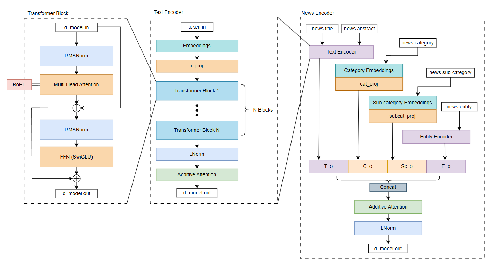
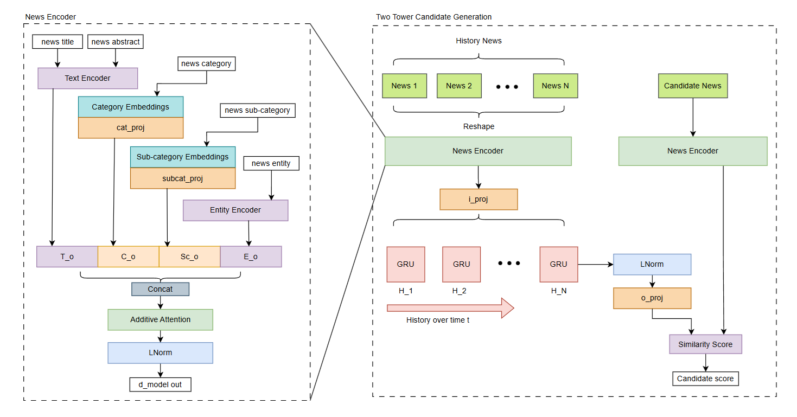

# MIND Recsys: Microsoft News Dataset Recommendation System

## About MIND Dataset

The **Microsoft News Dataset (MIND)** is a large-scale benchmark dataset for news recommendation collected from anonymized user behavior logs on Microsoft News. The full dataset contains about **160,000 English news articles**, more than **15 million impression logs**, and behavior data from about **1 million users**.

Each news item provides multiple content signals such as its **title, abstract, category, sub-category, and entity annotations**, while the user behavior data contains historical clicked news and impression-level click/non-click feedback. These signals make MIND suitable for studying both **content-aware news representation** and **sequential user-interest modeling**.

For the complete dataset format and field descriptions, see the [MIND Dataset Information](https://github.com/msnews/msnews.github.io/blob/master/assets/doc/introduction.md). The dataset was introduced in the ACL 2020 paper [MIND: A Large-scale Dataset for News Recommendation](https://aclanthology.org/2020.acl-main.331/).

## Architecture Overview

The model uses a **two-tower candidate-generation architecture**. A shared News Encoder maps both historical and candidate news into a common representation space, while the User Tower summarizes the sequence of a user's previously clicked news into a user embedding. Candidate relevance is then computed from the similarity between the user representation and each candidate-news representation.

The architecture combines ideas from **NRMS**, **NAML**, and **LSTUR**: Transformer-based text encoding for contextual news understanding, multi-view feature fusion for representing each article, and a recurrent user encoder for modeling sequential browsing history.

### News Tower



The **Text Encoder** processes the textual fields, including the news title and abstract. Input tokens are first mapped to learned embeddings and projected through `i_proj` before passing through `N` Transformer blocks. Each Transformer block uses a pre-normalized structure with **RMSNorm**, **multi-head self-attention**, **RoPE (Rotary Positional Embeddings)**, residual connections, and a **SwiGLU feed-forward network**. After the Transformer stack, layer normalization and additive attention are used to pool the token sequence into a fixed-size textual representation.

The feature representations are concatenated and passed through **additive attention**, allowing the model to learn how much information should be taken from each view.

### User Tower



The User Tower models a user's interests from their ordered news-click history.

Each previously clicked article (`News 1 ... News N`) is independently encoded by the shared **News Encoder**. The resulting sequence of news embeddings is projected through `i_proj` and processed chronologically by a **GRU**, producing hidden states `H_1 ... H_N`. The recurrent structure allows the user representation to depend on the order of consumed news and captures how the user's interests evolve across the browsing sequence.

The final GRU state is projected to produce the final user embedding. On the candidate side, each candidate article is independently passed through the same News Encoder to produce its candidate embedding.

The **candidate score** is obtained from a similarity function (dot-product or cosine-similarity) between the user embedding and the candidate-news embedding.

## Run the Program

The provided script allows you to train the model on your own, simply by running the command below:
```powerhsell
python train.py --model retrieval
```

Test the model with few sample first by adding the `--test` flag:
```powerhsell
python train.py --test --model retrieval
```

## References

1. [NRMS: Neural News Recommendation with Multi-Head Self-Attention](https://aclanthology.org/D19-1671/)
2. [LSTUR: Neural News Recommendation with Long- and Short-term User Representations](https://aclanthology.org/P19-1033/)
3. [NAML: Neural News Recommendation with Attentive Multi-View Learning](https://doi.org/10.24963/ijcai.2019/536)

## LICENSE

This project is licensed under the **Apache License 2.0**. See the [LICENSE](LICENSE) file for details.

The MIND dataset is distributed separately under the **Microsoft Research License Terms** and is not covered by this repository's Apache 2.0 license.
